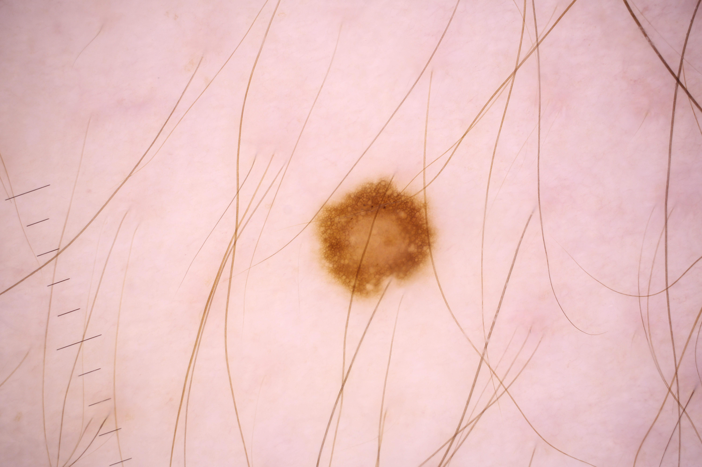

# Melanoma_Classifier

# Melanoma - Introduction
Skin cancer is the most prevalent type of cancer. Melanoma, specifically, is responsible for 75% of skin cancer deaths, despite being the least common skin cancer. As with other cancers, early and accurate detection—potentially aided by data science—can make treatment more effective.

Currently, dermatologists evaluate every one of a patient's moles to identify outlier lesions or “ugly ducklings” that are most likely to be melanoma. Existing AI approaches have not adequately considered this clinical frame of reference. Dermatologists could enhance their diagnostic accuracy if detection algorithms take into account “contextual” images within the same patient to determine which images represent a melanoma. If successful, classifiers would be more accurate and could better support dermatological clinic work.

Melanoma is a deadly disease, but if caught early, most melanomas can be cured with minor surgery. Image analysis tools that automate the diagnosis of melanoma will improve dermatologists' diagnostic accuracy. Better detection of melanoma has the opportunity to positively impact millions of people.

    
Normal Skin Lesion

# About Data and Code

This is an ongoing kaggle contest hosted by Society for Imaging Informatics in Medicine (SIIM). SIIM have provided 100GB data of melanoma skins out of which 98.3% data belong to normal skin(negative class) and just the remaining 1.7% belong to melanoma skin lesions(positive class). There is a huge class imbalance here and I've addressed it in my code by giving weightage to positive class predictions. 
Use the code melanoma-pytorch-starter to train your own model.
